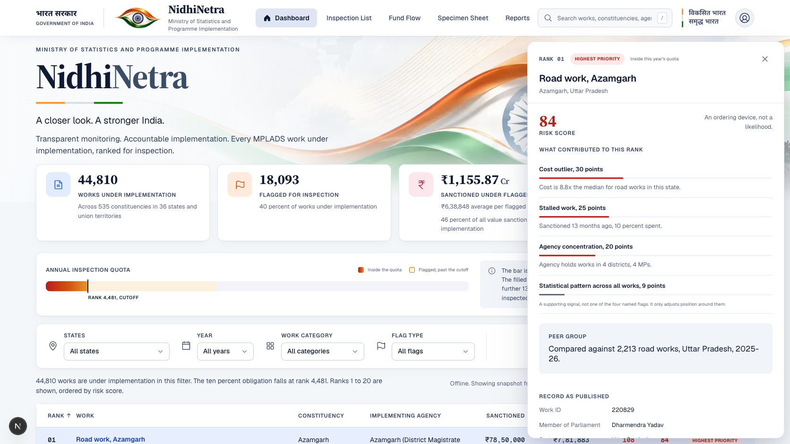
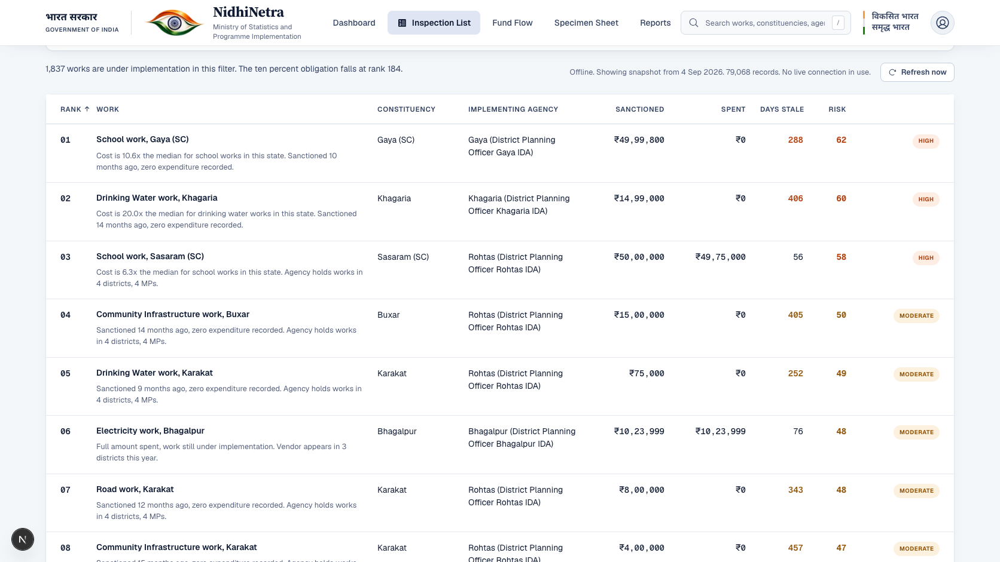
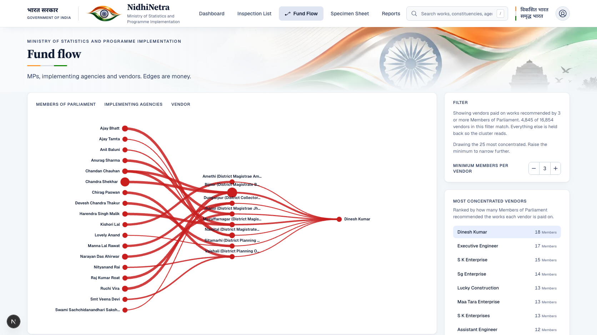

# NidhiNetra

**Smart India Hackathon 2026 · Problem Statement SIH26102 · Ministry of Statistics and Programme Implementation (MoSPI)**

An inspection-targeting tool for MPLADS (Members of Parliament Local Area Development Scheme). MPLADS guidelines require District Authorities to physically inspect at least 10% of works under implementation every year, and nothing in the existing public dashboards tells them which 10%. NidhiNetra ranks that already-mandated queue by risk and states, in plain language, why each work is on it. It is an ordering device for a fixed inspection budget, not an accusation and not a fraud finding.



## The problem, concretely

- **79,068** MPLADS works are on record; **44,810** of them are under implementation right now, across **36** states and union territories and **535** constituencies.
- District Authorities must inspect **10%** of that population every year (MPLADS guidelines clause 4.5.2). With a population this size, "which ones" is the entire problem: nobody can inspect all of them, and nothing ranks them today.
- **18,093** works currently carry at least one risk flag, worth ₹1,155.87 crore in sanctioned value, a small fraction of which the quota will actually reach this year.

NidhiNetra turns "inspect 10%, chosen how?" into a ranked, explainable, server-computed queue.

## How ranking works

Every work under implementation is scored against up to four independent, named detectors, each computed from the public record and each explained in one sentence when it fires:

| Flag | What it catches |
|---|---|
| `cost_outlier` | Sanctioned cost is a large multiple of the median for comparable works (same category, same state, same year) |
| `stalled_work` | Sanctioned a long time ago, with disproportionately little spent |
| `agency_concentration` | The implementing agency holds an unusually concentrated share of works or MPs |
| `expenditure_mismatch` | Spend and progress do not track each other the way comparable works do |

A fifth, smaller signal (a statistical pattern across the full population) adjusts position without being one of the four named, explained flags. The result is a **risk score from 0 to 100**, presented everywhere in the product as *"an ordering device, not a probability"* — it is never rendered as a likelihood, a verdict, or a confidence level.

The 10% quota line itself is one formula, in one file (`05-App/api/src/nidhinetra_api/policy.py`), imported by every server that needs it, so the ceiling can never drift between the dashboard, the inspections API, and the frontend:

```python
def quota_for(population_n: int) -> int:
    if population_n <= 0:
        return 0
    return max(1, -(-population_n * QUOTA_PERCENT // 100))  # ceil, integer-only
```

Recorded inspection outcomes are compared against the ranked list with a **Wilson score interval** (95%, continuity-corrected), and that comparison only renders once both the ranked group and the random-spot-check group have reached 30 inspections that actually reached the work — small samples are stated as small, not extrapolated.

## Full tech stack

| Layer | Technology |
|---|---|
| Frontend framework | Next.js 16.3.4 (App Router, Turbopack), React 19.2, TypeScript |
| Frontend styling | CSS Modules over a hand-built token system (`05-App/web/styles/tokens.css`); no CSS framework |
| Frontend motion & UI primitives | Motion (`motion/react`), Radix UI (Select, Popover, Dialog, Tooltip), Phosphor Icons |
| Frontend testing | Vitest, Testing Library |
| Backend framework | FastAPI (Python 3.11+), Pydantic v2 |
| Backend data engine | DuckDB over Parquet snapshots for the ranked work population; SQLite for recorded inspection outcomes |
| Data pipeline | A dedicated `nidhinetra_pipeline` package: ingest → normalize → risk-score → fund-flow graph → snapshot, run via `uv` as a workspace package the API imports in-process (never shells out) |
| Package management | `uv` (Python workspace: `api` + `pipeline`), `npm` (web) |
| Contracts | `05-App/contracts/` — JSON Schemas generate both the Pydantic models and the TypeScript types, and `05-App/contracts/strings.json` is the single source of every user-visible string in the product, in English and Hindi (Devanagari, correctly tagged `lang="hi"`) |

## Screenshots

| Dashboard + detail panel | Inspection list | Fund flow |
|---|---|---|
|  |  |  |

The app has four real, server-backed pages reachable from the top nav: **Dashboard** (the composed overview a jury sees first), **Inspection List** (the full, paginated, filterable, keyboard-first working queue), **Fund Flow** (which vendors sit behind the most-concentrated MP → implementing-agency → vendor clusters), and **Reports** (recorded inspection outcomes compared against the ranked list). Nothing in the nav is a stub or a mockup; every number on every page comes from the live API.

## Design

The design system lives in [`DESIGN.md`](DESIGN.md) (tokens, type scale, colour, motion, named rules) and [`PRODUCT.md`](PRODUCT.md) (who this is for, what it must never claim, and the constraints that shape it — no fabricated data, the State Emblem of India is never used, the tricolour is identity and never risk or status data, no em dashes anywhere in the interface). The visual language is "The Watchful Ledger": a government register kept under the tricolour eye — cool paper, white ledger cards, ink-navy type, one interactive blue, and a warm ramp reserved for risk, on the reasoning that a government risk tool should never let a colour read as "verified clean."

## Repository layout

```
05-App/                    the application
├── api/                   FastAPI backend (routers: works, stats, inspections, graph, refresh)
├── pipeline/               ingest, normalize, risk scoring, fund-flow graph, snapshot builder
├── web/                    Next.js frontend
├── contracts/              JSON Schemas + strings.json (the only source of UI copy)
├── data/snapshot/          committed demo snapshot (what the app runs from without a live pull)
└── README.md               how to run the app locally

DESIGN.md                  design system: tokens, type, colour, motion, named rules
PRODUCT.md                 product truth: users, constraints, brand commitments
04 Prototype/Logbook.md    append-only build log for this project
```

The numbered `01`–`05` top-level folders outside `05-App/` are the Smart India Hackathon working documents (problem statement, research, build plan, prototype notes, design references) kept alongside the app for the competition record.

## Running it locally

```bash
# Backend
cd "05-App/api"
uv run uvicorn nidhinetra_api.main:app --reload --port 8000

# Frontend, in a second terminal
cd "05-App/web"
npm install
npm run dev
```

The frontend talks to `http://localhost:8000` by default (override with `NEXT_PUBLIC_API_BASE_URL`). See [`05-App/README.md`](05-App/README.md) for the full command set, including `make validate`, `make contracts`, and `make demo`.

## Deploying it

**Frontend (Vercel):** import this repository and set **Root Directory** to `05-App/web` and **Framework Preset** to `Next.js` (a monorepo, so neither is auto-detected correctly by default). Add an environment variable `NEXT_PUBLIC_API_BASE_URL` pointing at wherever the backend below ends up.

**Backend (Render, or any host that runs a Dockerfile-free Python web service):** [`render.yaml`](render.yaml) at the repo root is a Render Blueprint — Render dashboard → New → Blueprint → pick this repository, and it provisions the service from that file. It builds and runs from the `05-App` workspace with `uv` (`uv sync --package nidhinetra-api --locked`, then `uv run --package nidhinetra-api uvicorn nidhinetra_api.main:app --host 0.0.0.0 --port $PORT`), which is the one command that correctly resolves `nidhinetra-api`'s workspace dependency on `nidhinetra-pipeline` — a plain `pip install` from `api/` alone cannot do that. Set the deployed service's `ALLOWED_ORIGINS` environment variable to the frontend's exact Vercel origin(s) (comma-separated, e.g. `https://nidhinetra.vercel.app`) once that URL is known; unset, the API accepts only local dev origins by design (`05-App/api/src/nidhinetra_api/main.py`).

## Status

Frontend redesign complete against the pinned reference: all four real pages ship, `tsc`, ESLint, and the Vitest suite pass clean, and `next build` produces a clean static production build. Backend: works listing (search, facets, scope, pagination), stats summary, inspections/outcomes reporting with Wilson intervals, and the fund-flow graph are all implemented and tested.

---

Built for the Ministry of Statistics and Programme Implementation. Smart India Hackathon 2026 prototype.
